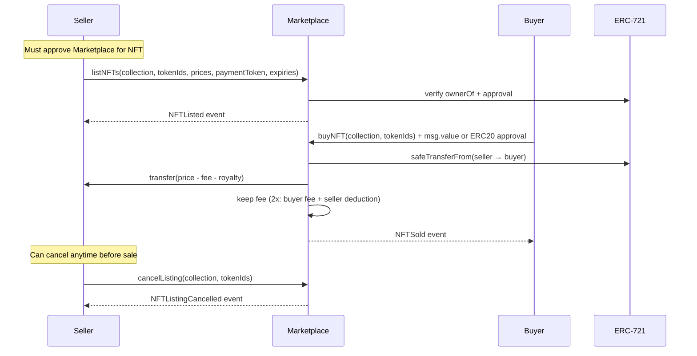
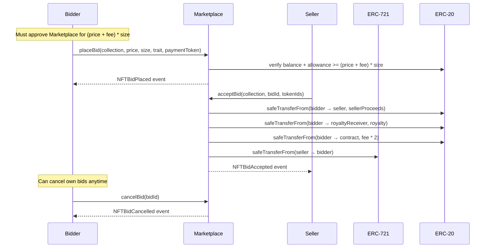
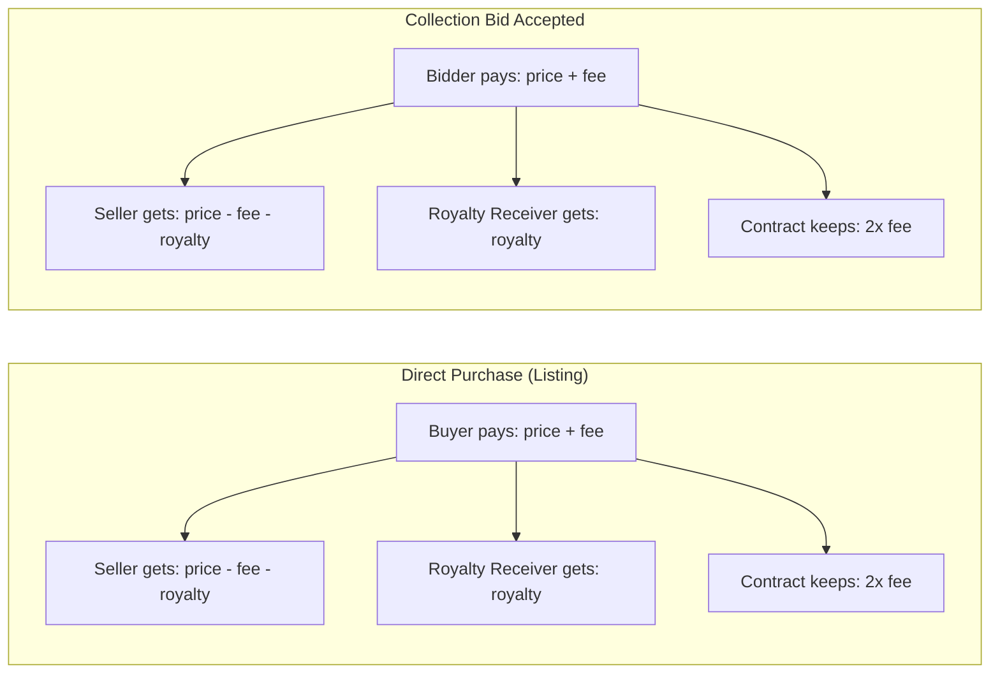
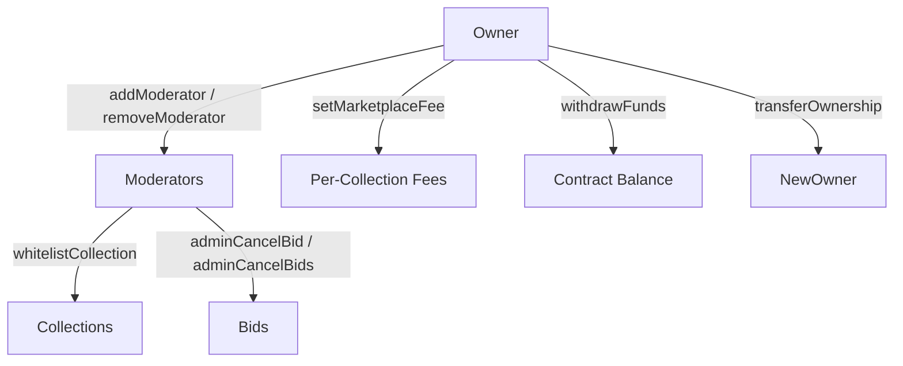
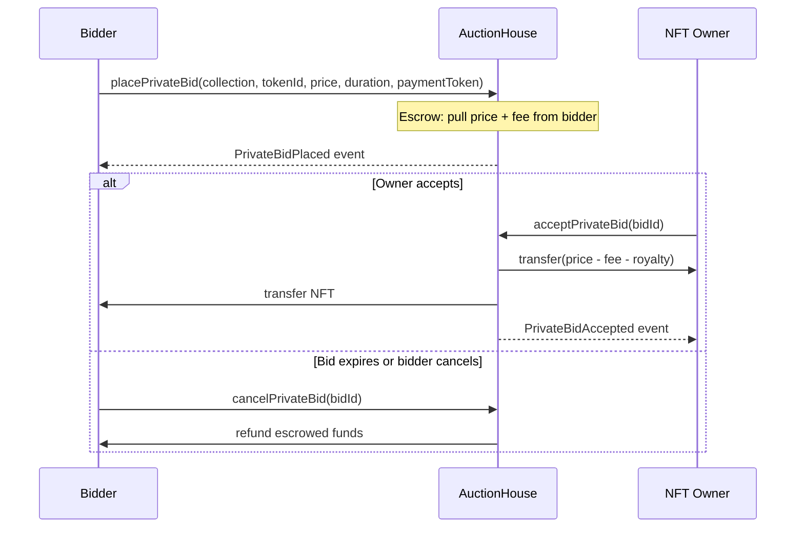
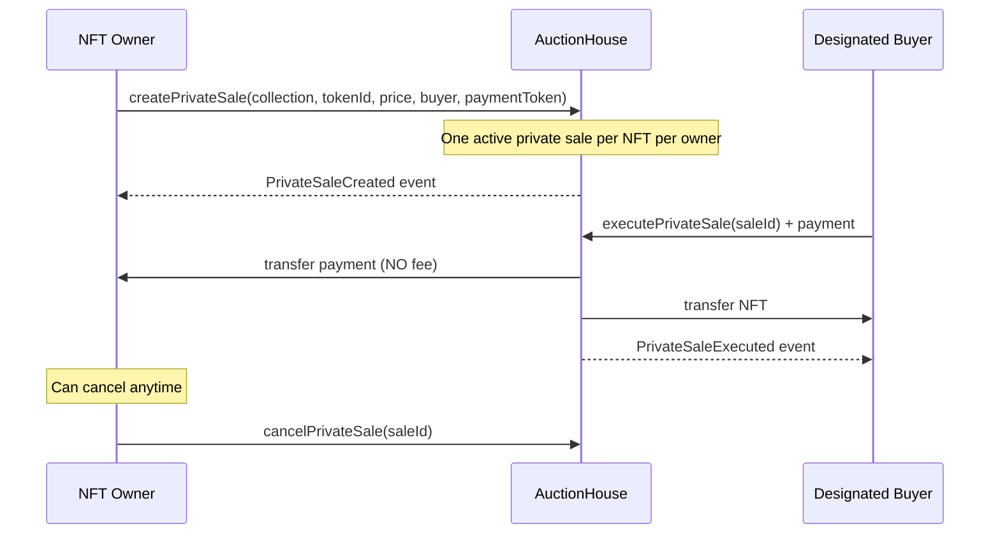
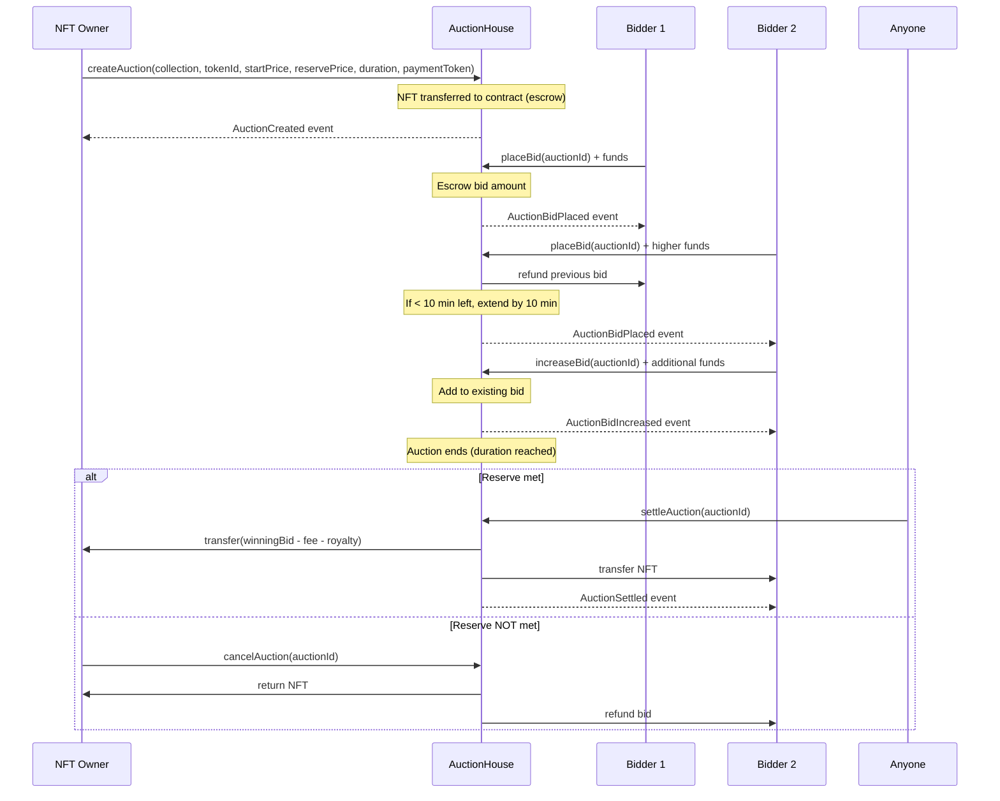
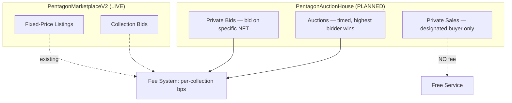

# Pentagon Marketplace Contracts

NFT Marketplace smart contracts for **Pentagon Chain** (Chain ID: 3344).

## Contract Summary

| Contract | Address | Status |
|----------|---------|--------|
| **PentagonMarketplaceV2 (V2.1)** | `0xecC0ba6e383EE0C2Af89dF54cdC6Db743421a76A` | ✅ LIVE |
| PentagonMarketplaceV2 (V2) | `0xCF4582883e73c5bd00F6F11A8929428ACAEDb7aF` | ❌ DEPRECATED |
| PentagonMarketplaceV1 | `0x704C82eB1f2a6f700743Eaa7c5c7678263B80500` | ❌ DEPRECATED |

**Chain:** Pentagon Chain (3344)
**RPC:** `https://rpc.pentagon.games`
**Deployer:** `0xE6d7d2EB858BC78f0c7EdD2c00B3b24C02ca5177`

---

## Architecture

**1 contract** handles everything: listings, purchases, and collection bids.

```
PentagonMarketplaceV2 (Ownable, ReentrancyGuard)
├── Listings       — sellers list NFTs at fixed prices, buyers purchase
├── Collection Bids — bidders offer on any NFT in a collection, sellers accept
├── Fee System     — per-collection basis points, ERC-2981 royalties
└── Admin          — owner + moderator roles, whitelisting, fee config
```

**Dependencies:** OpenZeppelin v5 (Ownable, ReentrancyGuard, SafeERC20, IERC2981, IERC721)

### Roles

| Role | Permissions |
|------|-------------|
| **Owner** | All moderator permissions + `setMarketplaceFee`, `withdrawFunds`, `addModerator`, `removeModerator`, `transferOwnership` |
| **Moderator** | `whitelistCollection`, `adminCancelBid`, `adminCancelBids` |

---

## Flow Diagrams

### Listing Flow (List, Buy, Cancel)



### Collection Bid Flow (Place, Accept, Cancel)



### Fee Flow



### Admin Flow



---

## Function Reference

### Constants

| Name | Value | Description |
|------|-------|-------------|
| `MIN_BID` | 0.01 ether | Minimum listing price or bid amount |
| `BID_INCREMENT` | 0.01 ether | Bids must be multiples of this |
| `FEE_DENOMINATOR` | 10000 | Basis points denominator (100% = 10000) |

### Listing Functions

#### `listNFTs(collection, tokenIds[], prices[], paymentToken, expiries[])`
List one or more NFTs for sale. Caller must own the tokens and have approved the marketplace. Collection must be whitelisted. Prices must be >= MIN_BID. Set `expiry = 0` for no expiration. Use `paymentToken = address(0)` for native PC payment, or an ERC-20 address.

#### `cancelListing(collection, tokenIds[])`
Cancel one or more of your own listings. Only the original seller can cancel.

#### `buyNFT(collection, tokenIds[])`
Purchase one or more listed NFTs. For native PC: send `msg.value >= sum(price + fee)`. For ERC-20: approve the marketplace for the total amount first. Handles ERC-2981 royalties automatically. Excess native PC is refunded.

### Collection Bid Functions

#### `placeBid(collection, price, size, trait, paymentToken)`
Place a bid on any NFT in a whitelisted collection. `size` = how many NFTs you want at that price. `trait` is a string filter (off-chain matching). Must use ERC-20 (`paymentToken != address(0)`). Bidder must have balance and allowance for `(price + fee) * size`.

#### `acceptBid(collection, bidId, tokenIds[])`
Accept a collection bid by providing specific token IDs. Caller must own the tokens. Can partially fill (accept fewer than `size`). Remaining `size` stays open.

#### `cancelBid(bidId)`
Cancel your own bid. Only the original bidder can cancel.

#### `adminCancelBid(bidId)` / `adminCancelBids(bidIds[])`
Moderator/owner can cancel any bid(s). Used for spam cleanup or collection de-whitelisting.

### Admin Functions

#### `addModerator(address)` / `removeModerator(address)` (Owner only)
Grant or revoke moderator role.

#### `whitelistCollection(collection, status)` (Moderator+)
Enable or disable a collection for trading.

#### `setMarketplaceFee(collection, fee)` (Owner only)
Set fee in basis points for a collection. Max 1000 (10%).

#### `withdrawFunds(token, amount)` (Owner only)
Withdraw accumulated fees. `token = address(0)` for native PC, otherwise ERC-20 address.

### View Functions

#### `getBidFeeAmount(bidId)` → `uint256`
Returns the fee amount for a specific bid.

#### `getRequiredApproval(collection, price, size)` → `uint256`
Returns total ERC-20 approval needed: `(price + fee) * size`.

---

## Fee Structure

- **Per-collection**, set in basis points (1 bp = 0.01%)
- **Current rate:** 250 bps (2.5%) on all whitelisted collections
- **Max allowed:** 1000 bps (10%)
- **Double fee model:** Contract collects fee from BOTH sides
  - Buyer/bidder pays: `price + fee`
  - Seller receives: `price - fee - royalty`
  - Contract keeps: `fee * 2`
- **ERC-2981 royalties** deducted from seller proceeds automatically

---

## Whitelisted Collections

| Collection | Address | Fee |
|------------|---------|-----|
| Setsuko | `0xcDAD57bFc48E8373280C6dc3039C5169353B6879` | 2.5% |
| Jewelry | `0xc05b96b89Ce46c306223E3f4c413891d17E1De70` | 2.5% |
| Gunnies PFP | `0x7a8a3236e3783E7cC33b97729378e31Cf14d3Ebc` | 2.5% |
| EF Genesis | `0x8F83c6122Dd4d275B53a7846B3D3dB29Cca1e698` | 2.5% |
| Rugpull | `0xD77f88ef51b2589D132D6eb61068079F61Dfe4A3` | 2.5% |

---

## Security (V2.1 Audit Fixes)

| Fix | Description |
|-----|-------------|
| **SafeERC20** | All ERC-20 transfers use `safeTransferFrom` / `safeTransfer` |
| **Underflow protection** | `require(fee + royaltyAmount <= price)` before subtraction |
| **Consistent fee logic** | Native PC and ERC-20 paths charge fees identically |
| **ReentrancyGuard** | On `buyNFT` and `acceptBid` (all payment functions) |
| **Moderator role** | Separates collection management from owner-level access |

---

## Deployment

Built with [Foundry](https://book.getfoundry.sh/).

```bash
# Build
forge build

# Test
forge test

# Deploy
forge script script/Deploy.s.sol:DeployMarketplaceV2 \
  --rpc-url pentagon \
  --private-key $PRIVATE_KEY \
  --broadcast
```

**Foundry config:** `via_ir = true`, optimizer 200 runs, solc 0.8.20

---

## Version History

| Version | Date | Changes |
|---------|------|---------|
| V1 | 2024 | Initial marketplace. DEPRECATED, 224 stale bids hidden, collections disabled. |
| V2 | May 2025 | Rewrite with ERC-20 support, collection bids, royalties. No funds ever flowed. |
| V2.1 | May 2025 | Audit fixes: SafeERC20, underflow protection, consistent fees, moderator role. **LIVE** |

---

## Planned: PentagonAuctionHouse Contract

A new standalone contract to add three features currently missing from the marketplace:

### 1. Private Bids (Token-Specific Bids)

Bid on a **specific NFT** (by collection + tokenId) rather than any NFT in a collection.



**Rules:**
- Minimum bid: 0.01 PC, increments of 0.01 PC
- Duration-based expiry (bidder sets)
- Multiple bids per NFT from different bidders allowed
- Funds escrowed on bid placement (pulled from bidder)
- Marketplace fee applies (same 2.5% structure)
- Bidder can cancel anytime (if not accepted). Auto-refund on expiry.

### 2. Private Sales

NFT owner creates a sale that **only one specific address** can buy.



**Rules:**
- **No marketplace fee** (free service, peer-to-peer)
- Only the designated `buyer` address can execute
- One active private sale per NFT per owner (prevents spam/abuse)
- Owner can cancel anytime
- Supports native PC or ERC-20 payment

### 3. Auctions (English Auction, OpenSea-style)

Owner starts a timed auction. Highest bidder wins.



**Rules:**
- **Anti-sniping:** Bids in the last 10 minutes extend the auction by 10 minutes (OpenSea model)
- **Reserve price:** Optional. If set and not met, owner can cancel and reclaim NFT
- **No reserve:** Sells to highest bidder regardless of final price
- **Bid increments:** Each new bid must exceed current highest by at least 0.01 PC
- **Increase bid:** Existing highest bidder can add to their bid without losing position
- **Settlement:** Anyone can call `settleAuction()` after end time. Finalizes transfer + payment.
- **Escrow model:** NFT held by contract during auction, bids escrowed on placement
- **Fee charged** on successful settlement (same basis-point structure)
- **ERC-2981 royalties** honored on settlement

### Contract Architecture (Planned)



Both contracts share the same whitelisted collections and fee configuration (or the new contract reads from V2.1, or duplicates the admin setup).

---

## Repository

- **Gitea (primary):** http://10.0.0.124:3000/nftprof/marketplace-v2-contract
- **GitHub:** https://github.com/blockchainsuperheroes/marketplace-v2-contract

## License

MIT
